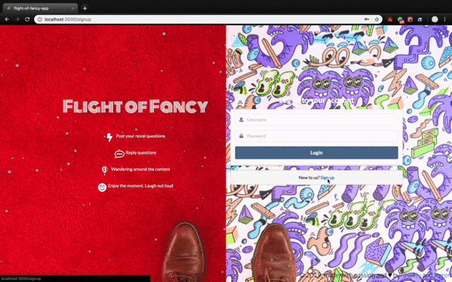

# [flight-of-fancy-app](https://flight-of-fantasy.herokuapp.com/)

## Author
- [Karen Cao](https://qimincao.github.io/HomePage_Karen/)
- [Freddy Lyu](https://freddydoesit.github.io/freddy/)

## Screenshot


## Project Objective

People would love to have some happy moments and be amused by some “useless and unrealistic” ideas. We want to build an app with pages not that serious and not that “useful”. 

Flight-of-Fancy App is  an app where people can create some content that is out of box. Something that may be improper to speak it out during normal situations. LoL!

CS5610 Course Link: http://johnguerra.co/classes/webDevelopment_spring_2019/ Love Professor John!

## Usage

First please make sure you have installed meteor, mongoDB, and React.

Then run the following commands in your terminal.

```
git clone https://github.com/QiminCao/flight-of-fancy-app.git
cd flight-of-fancy-app
meteor npm install
meteor
```
Open your browser and visit http://localhost:3000 and you should see the application.

## Technologies

- Platform: [Meteor](https://www.meteor.com/) with React - An open source platform for 
web, mobile, and desktop.
- UI: [Semantic UI](https://semantic-ui.com/) - A development framework that helps create beautiful, responsive layouts using human-friendly HTML.
- JavaScript library: particles.js, moment.js, simpl-schema.js
- API: [Adorable Avatars](http://avatars.adorable.io/)


## Video and Slides
Video demo of this project can be found [here](https://youtu.be/_bwwdzjsUgg). 

Slide of this project can be found [here](https://docs.google.com/presentation/d/1WmwlLXZRelC0Dg87GY_z6nNH6uMqHMSZK_bxEEwXbR8/edit#slide=id.g54f4327236_0_546).


## License
[](https://opensource.org/licenses/MIT)

This repository has the standard [MIT license](https://opensource.org/licenses/MIT). 